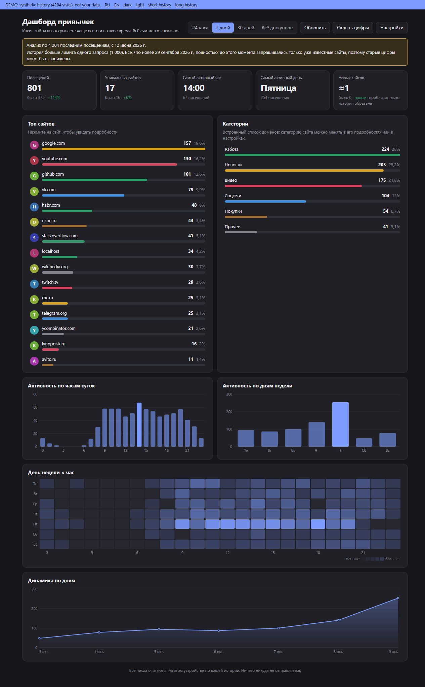

# Дашборд привычек / Habits Dashboard

Расширение для браузера Drift. Страница со статистикой по вашей истории: какие сайты вы открываете чаще всего и в какое время. Интерфейс на русском и английском.



*Скриншот сделан на искусственной истории (`demo.html`), не на чьих-то данных.*

*English: a Drift extension that shows a statistics page from your browsing history, in Russian and English. Everything is computed locally. See the sections below, which apply to both languages.*

## Приватность: это личные данные

- **Всё считается локально**, внутри браузера, на вашем компьютере. Расширение не отправляет **ничего и никуда**.
- Разрешение `network` расширение не запрашивает. В Drift оно сейчас всё равно ничего не даёт (в `manifest.rs` оно «зарезервировано»), а страница расширения работает с CSP `connect-src 'none'`: ни сети, ни `eval`, ни чужих скриптов.
- Разрешения минимальные:
  - `history_read`: только чтение истории. Удалять записи расширение не может (`history_write` не запрашивается);
  - `storage`: свои настройки и кэш;
  - `ui`: кнопка на панели, команды в палитре, своя страница;
  - `notifications`: необязательные «Итоги недели».
- Заголовки страниц из истории недоверенные: в интерфейс они попадают только через `textContent`, без `innerHTML`. Внешних ресурсов (шрифтов, значков сайтов, CDN) нет.

## Установка

1. Откройте Drift → **Дополнения → Установленные → загрузить распакованное**.
2. Выберите папку с этим расширением (где лежит `plugin.json`).
3. Подтвердите запрашиваемые разрешения и включите расширение.

Если вы правите исходники, после изменений в `aggregate.js` или `background.src.js` выполните `node build.js`. Подробности в разделе «Разработка».

## Как пользоваться

- Откройте дашборд кнопкой **«Дашборд привычек»** на панели или командой **«Дашборд привычек»** в палитре команд.
- Вверху выберите период: **24 часа**, **7 дней**, **30 дней** или **всё доступное**. Сравнение идёт с предыдущим периодом такой же длины (для «всё доступное» сравнения нет).
- **Карточки:** посещения, уникальные сайты, самый активный час, самый активный день недели, новые сайты. «Новый» сайт: в доступной истории его первое посещение попало в выбранный период. Если история обрезана лимитом, число помечается «≈» (приблизительно): сайт, старых посещений которого мы не загрузили, может считаться новым.
- **Топ сайтов:** домены, число посещений, доля. Клик по сайту открывает его детали: график по часам и по дням недели, последние страницы (только заголовки) и выбор категории.
- **Активность по часам**, **по дням недели**, **тепловая карта «день недели × час»**, **динамика** (по часам для 24 часов, по дням, а для очень длинной истории по неделям).
- **Категории:** соцсети, видео, работа, новости, покупки, прочее. Определяются по встроенному списку доменов. Свою категорию для домена задайте в деталях сайта или в «Настройках», она важнее встроенной.
- **Настройки:** сайты-исключения (не показываются нигде, в том числе в сравнении), правила категорий, еженедельные итоги.
- **Скрыть цифры** размывает числа, домены, заголовки и графики, подсказки при наведении отключаются. Выбор запоминается и применяется до показа данных.
- **Обновить** перечитывает историю. Открытие страницы тоже читает историю заново, так что очищенная история сразу исчезает из статистики. Переключение периода на открытой странице использует уже загруженные данные.
- **Итоги недели:** команда в палитре показывает короткое уведомление сразу. Автоматически раз в неделю уведомление приходит, только если включить его в «Настройках» (по умолчанию выключено). Drift ограничивает уведомления плагина, максимум 3 в минуту.

## Какие данные видны и где хранятся

| Что | Где |
|---|---|
| История посещений (адрес, заголовок, время) | Читается из истории Drift, расширение её не копирует и не меняет |
| Настройки: исключения, правила категорий, «скрыть цифры», еженедельные итоги | storage расширения (`settings`) |
| Кэш агрегатов (только числа и домены, **без заголовков страниц**) со временем расчёта | storage расширения (`cache`). Нужен только для быстрой первой отрисовки: страница сразу пересчитывает данные заново. Записи старше 10 минут удаляются при запуске браузера, кэш сбрасывается при смене исключений и категорий |

Хранилище расширения Drift лежит в профиле браузера, в папке расширения. Оно не передаётся никуда и удаляется вместе с расширением. Размер ограничен самим Drift (5 МБ), кэш занимает единицы килобайт.

## Ограничения (проверено по исходникам Drift)

- **Один вызов `history.search` отдаёт не больше 1000 записей, самые свежие первыми.** Ни пролистывания, ни фильтра по времени в API нет, поиск `query` ищет подстроку в адресе и заголовке. Drift хранит около **5000** записей, а срок хранения задаётся его настройкой, так что старше этого предела данных нет вообще. Приватные окна в историю не попадают, поэтому в статистике их тоже нет.
- **Как расширение обходит лимит:**
  1. Один запрос без фильтра. Если вернулось меньше 1000 записей, история загружена целиком.
  2. Иначе всё **новее самой старой записи этого запроса** известно полностью.
  3. Для более старого времени расширение делает запросы по доменам из топа (по 1000 свежих записей на каждый) и запросы-«зонды» по `.com`, `.ru`, `.org` и подобным, чтобы найти новые домены. Всего не больше 60 вызовов за обновление.
  4. Записи без повторов объединяются, а страница **прямо говорит**, что именно получилось.
- **Что это значит для цифр.** Плашка вверху пишет «Анализ по N последним посещениям, с <дата>». Если история больше лимита, она жёлтая и добавляет: с какой даты картина полная, что старше этой даты неполно (в основном известные сайты, цифры могут быть занижены), у каких сайтов достигнут лимит запроса. Для периода, который начинается раньше «полной» даты, отдельно написано, что его цифры неполные. Обойти это нечем: API не умеет большего.
- Сайты-исключения не запрашиваются отдельно, но их записи всё равно занимают места в «последней 1000» и просто не учитываются в цифрах. Если много посещений приходится на исключённые сайты, полный обзор может покрывать меньший срок.
- **Время считается в локальном часовом поясе** компьютера (дни и часы по местному времени, неделя с понедельника). Периоды «7 дней» и «30 дней» это последние N календарных дней, включая сегодня. «24 часа» это скользящие сутки.
- Домен определяется приближённо, без списка публичных суффиксов: берутся две последние части (`mail.google.com` → `google.com`), для `co.uk`, `com.br` и подобных три. Категории сверяются и с полным хостом (`docs.google.com`).
- Иконок сайтов нет (сети нет), вместо них круглая метка с первой буквой и цветом от хеша домена.

## Как это устроено

- `background.js` (собирается из `aggregate.js` и `background.src.js`) читает историю и считает все числа. Страница получает уже готовые агрегаты через `driftPlugin.runtime.sendMessage` и к истории сама не ходит.
- `page.html`, `page.css`, `page.js`, `charts.js`: страница в песочнице Drift. Графики нарисованы вручную на SVG без библиотек. Цвета берутся из переменных темы браузера (`--bg-app`, `--accent` и других), поддерживаются светлая и тёмная тема и `prefers-reduced-motion`.
- `aggregate.js`: чистые функции без обращений к браузеру. Тот же код запускается в браузере и под Node.

## Разработка

```
node build.js          # собрать background.js (Drift загружает только один фоновый файл)
node build.js --check  # проверить, что background.js актуален
node --test            # тесты, без зависимостей
```

`test/aggregate.test.js` проверяет агрегацию на искусственной истории: границы периодов, полночь, часовые пояса, пустую историю, один сайт, исключения, категории, сравнение с прошлым периодом. `test/background.test.js` запускает собранный `background.js` с макетом `history.search`, который ведёт себя как Drift (подстрока, свежие первыми, максимум 1000), и проверяет обход лимита. `test/package.test.js` сверяет `plugin.json` с правилами `manifest.rs` и проверяет, что в коде нет `innerHTML`, `eval`, сетевых вызовов и внешних адресов.

### demo.html

`demo.html` открывается в **обычном браузере** (двойной клик) и показывает страницу на искусственной истории. Она не связана с Drift и не содержит ваших данных. Переключатели языка, темы и размера истории вверху. Демо запускает настоящий `background.js` через `demo-shim.js`, который имитирует API Drift. В Drift эти файлы не нужны.
